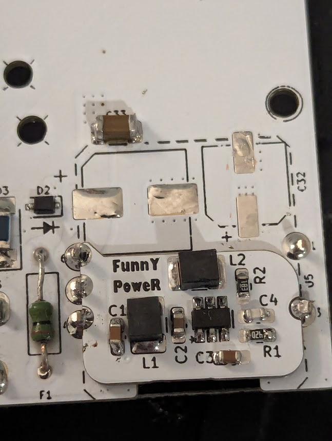

# FunnyPower
Piggyback voltage regulator for Game Boy Pocket LCD rail

## What is this?
Most aftermarket Game Boy Pocket and Color regulators do not provide the unregulated voltage rails required by the OEM LCD to operate. Additionally, the FunnyPlaying pocket screen kit requires this voltage in order to enable brightness control via the contrast wheel.

This board restores that functionality by generating an ~-18V regulated voltage from the 5V coming out of the primary regulator. This may also give better performance if you are using an aftermarket IPS screen, but please see my disclaimer below.

The circuit is based on the reference circuit for the LT3462 IC with adjustments for the specific voltage requirements and PCB size constraints.

My personal recommendation if you are using the OEM screen is to stick with an OEM regulator. 

## Disclaimer
I have not done any battery life, efficiency, or performance testing with this. I have only done functional testing. It functions with both the OEM screen and as a contrast-wheel adjustment for the FP screen (primary intended use). I am not making any claims as to the capabilities of it compared to the OEM regulator. The primary reasons for using this are _aesthetic_ or to gain additional functions provided by a replacement primary regulator (indicator, LIPO support, soft-power) without losing the LCD rail.

## Compatibility
To ensure compatibility, I advise making sure that whatever primary regulator you are using is _disconnected_ from the Game Boy PCB at Pin 5 if that board has a solder point for that pin.

All front-connected TPS61202-based game boy pocket regulators are likely compatible, as well as most other front-connected, non-OEM regulators

Some Examples:
- [Froggo Customs Frogulator](https://froggocustoms.com/products/frogulator-game-boy-color-pocket-dc-regulator)
- [Pocket Mouse Power Board](https://github.com/MouseBiteLabs/Pocket-Mouse-Power-Board)
- [Skimzor SZ-REG](https://github.com/skimzor/SZ-REG)
- [GBPP](https://github.com/marshallh/gbpp)
- [Natalie The Nerd Safer Charge DC](https://nataliethenerd.com/products/safer-charge-dc)

## BOM
|REF|Value|Size|
|-------|------|-----|
|C1, C2, C3 |1 uF|0603 SMD|
|C4|15 pF|0603 SMD|
|L1, L2|47uH|1210 SMD|
|U1|LT3462|TSOT-23|
|R1|267k ohm|0603 SMD|
|R2|18k ohm|0603 SMD|

## Recommended Fabrication settings
0.8 or 1.0 MM board thickness, HASL

Because I use false castellations some trimming of excess copper around the edges of the PCB at the pin connection points may be necessary prior to installation

## License
PLEASE NOTE, THIS IS A NON-COMMERCIAL LICENSE, THIS IS DIFFERENT THAN MOST OF MY PROJECTS

**CC-BY-NC-SA**
https://creativecommons.org/licenses/by-nc-sa/4.0/deed.en
